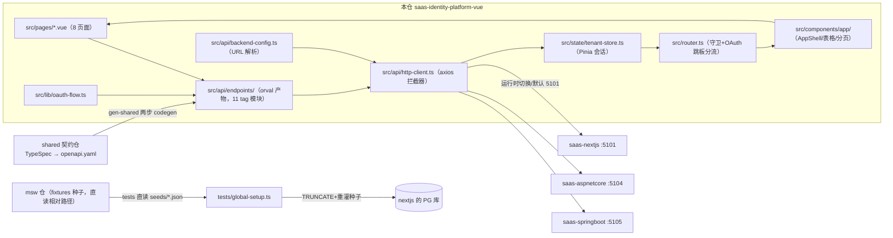
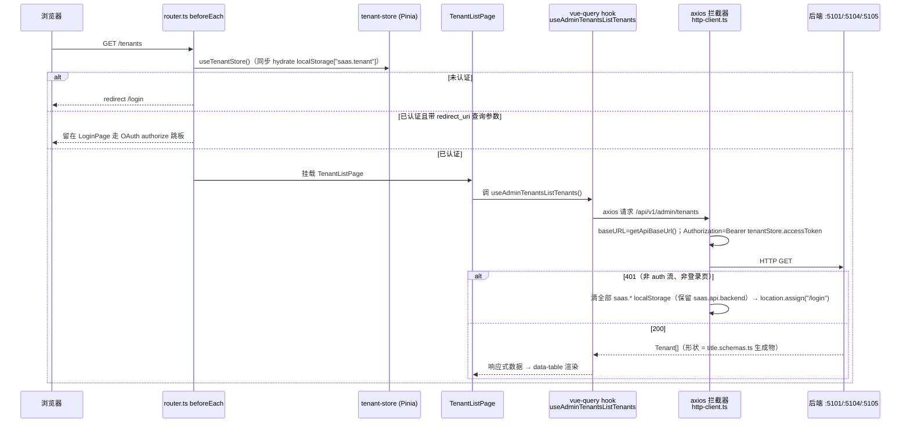

# saas-identity-platform-vue 架构

> 一句话定位：saas-identity-platform 多仓家族中的 **Vue 前端仓**——用 Vue 3.5 + Vite + Pinia + Vue Query 实现同一份产品契约的管理端 SPA，API 客户端与类型全部来自 shared 契约仓的 orval 生成物，可对接 nextjs / aspnetcore / springboot 三个真后端。

生成日期：2026-09-22 ｜ 锚定 HEAD：c759d15 ｜ 生成方式：DeepWiki 风格架构扫描

## 1. 总览

- **家族角色**：前端仓（6 角色中的「前端」）。与 saas-identity-platform-react / -nextjs 平行，各自实现同一份 shared 契约；由 contract-test 仓黑盒校验、e2e 仓做跨端验收。
- **技术栈**（钉死于 `version-lock.json`）：Vue ^3.5、Vite ^6、TypeScript ^5.7、Pinia ^2.3、@tanstack/vue-query ^5.62、axios ^1.7、Tailwind v4、shadcn-vue（Reka UI）、orval ^7.5（`client: "vue-query"`）、vitest ^2.1。
- **身份**：书稿配套仓 + harness 门禁仓双身份；功能树（Mxx.Fxx.Ixx）是改动锚点，`data-fn` 挂 ID。
- **规模速览**（真实文件统计）：
  - 路由 9 条（含 `/login` 与 catch-all 重定向），页面组件 8 个（`src/pages/`）
  - orval 生成物 11 个 tag 模块 + `title.schemas.ts`，共约 4463 行（`src/api/endpoints/`）
  - UI 基础组件 30 个（`src/components/ui/`）+ 应用壳组件 14 个（`src/components/app/`）
  - 集成测试 11 个文件、约 64 个用例（`tests/integration/`）
  - 自研基础设施层（`src/api/*.ts` + `src/state/` + `src/lib/`）约 550 行

## 2. 系统架构

关键边界三句话：

1. **契约边界单向**：shared 仓只出 `openapi.yaml`，本仓经 `npm run gen:shared` 生成 `src/api/endpoints/`，禁止从 shared 直接 import TS 客户端（CLAUDE.md §2）。
2. **HTTP 边界单点**：所有请求都过 `http-client.ts` 的全局 axios 拦截器（注入 baseURL + Bearer token），页面只调 orval 具名函数/hooks，禁止组件内直接 fetch。
3. **测试边界真链路**：vitest `globalSetup` 对真实 PG 灌种子、拉起真 nextjs :5101、铸真 JWT，测试直连真后端，不降级 mock。

## 3. 模块分解

| 模块/目录 | 职责 | 关键文件 |
|---|---|---|
| `src/api/endpoints/` | orval 生成的 API 层（唯一 API 面），按 tag 拆 11 模块，每个端点 = 具名函数 + vue-query hook；schema 收敛在 `title.schemas.ts` | `admin-tenants/admin-tenants.ts`、`oauth/oauth.ts`、`title.schemas.ts` |
| `src/api/http-client.ts` | 装 axios 请求/响应拦截器（baseURL + Bearer）；`ApiError` 封装；401 统一清会话踢回 `/login` | `http-client.ts`（121 行） |
| `src/api/backend-config.ts` | 后端寻址：BACKENDS 端口表 + prod 域名；dev 运行时切换器（localStorage `saas.api.backend`），prod 构建剔除无 prodBaseUrl 项 | `backend-config.ts`（97 行） |
| `src/api/env.ts` | `import.meta.env.VITE_*` 仓内唯一适配点，非空才采纳 | `env.ts`（19 行） |
| `src/state/` | Pinia 会话 store：tenant + JWT + user，持久化 `saas.tenant`，首次 `useTenantStore()` 同步 hydrate | `tenant-store.ts`（165 行） |
| `src/lib/oauth-flow.ts` | RFC 6749 §4.1 授权码流薄封装（state 生成/常量时间校验），叠在 orval `oAuthAuthorize/oAuthToken` 上 | `oauth-flow.ts`（147 行） |
| `src/router.ts` | 9 条路由 + `beforeEach` 鉴权守卫 + OAuth `redirect_uri` 跳板分流（已登录也走完 authorize） | `router.ts`（64 行） |
| `src/pages/` | 8 个业务页：租户/成员/角色/角色授权/租户应用/应用客户端/菜单树/登录 | `TenantListPage.vue`、`LoginPage.vue` 等 |
| `src/components/ui/` + `app/` | shadcn-vue 基础件 + AppShell/data-table/pagination 等应用件 | `app-shell.vue`、`data-table.vue` |
| `scripts/gen-shared.ts` | codegen 编排（见 §5）；写 ADR-0026 staleness marker | `scripts/gen-shared.ts` |
| `tests/` | jsdom + 真链路集成测试；`FnReporter` 产出功能 ID trace（`TRACE_MAP=1`） | `global-setup.ts`、`helpers/real-chain.ts`、`fnReporter.ts` |
| `deploy/` + `Dockerfile` | 两阶段镜像构建 + VPS nginx vhost 模板 + tag 部署脚本 | `Dockerfile`、`deploy/saas-identity-platform-vue.sh` |

## 4. 数据流 / 请求生命周期

代表性链路：**已登录用户打开「租户列表」页，从路由到数据呈现**。

登录链路（ADR-0013）：`LoginPage` → `oauth-flow.ts` 生成 state 存 `saas.vue.oauth.state` → 调 `oAuthAuthorize` 签 code → `oAuthToken` 换 token → `tenant-store.login()` 落 `saas.tenant`。vue 仓不做密码登录（M01.F04.* 不在本仓）。

## 5. 依赖面

**对 shared 契约仓（`../saas-identity-platform-shared`）**：

- 消费方式 = `npm run gen:shared`（`scripts/gen-shared.ts`）两步 codegen：
  1. 在 shared 仓跑 `npm run emit:openapi`，产出 `generated/openapi/openapi.yaml`
  2. 本仓 `npx orval`（`orval.config.ts`：`mode: "tags-split"`、`client: "vue-query"`、`clean` 输出目录）生成 `src/api/endpoints/`，随后 `prettier --write` 保证 regen byte-idempotent
- 同步凭证：`.state/last-gen-shared.json`（ADR-0026 marker，同 sha 零写入）；当前锚 shared HEAD `62d305b`（2026-09-20）
- 测试还直读 shared 的 `seeds/*.json`（DB 快照权威源）作为断言锚
- `prebuild` 钩子自动跑 gen:shared，改了 shared 必须重生成

**对家族其他仓**：

- `saas-identity-platform-nextjs`：单测真链路基座（globalSetup 拉起/复用 :5101，读其 `.env.local` 补 env）
- msw 仓：已于 2026-09-17 删除——本仓单测走真链路（`tests/global-setup.ts` 直连真 nextjs :5101），零 npm 依赖；禁止回引 `@saas/identity-platform-msw` 包依赖、msw fixtures 路径或浏览器 SW 模式（tsconfig include / Dockerfile / CI / `.npmrc` 残留引用已于 2026-09-22 收尾清理，Dockerfile 顺势切 `npm ci`）
- contract-test / e2e 仓：黑盒校验本仓实现的契约面（不在本仓内）

**外部依赖**：PostgreSQL（经被测后端，间接依赖）；IdP 登录走 OAuth 授权码流；无其他第三方服务。

## 6. 配置与部署

**env 变量表**：

| key | 用途 | 缺失时行为 |
|---|---|---|
| `VITE_API_BASE_URL` | 后端 base URL（单 URL，ADR-0014） | `env.ts` 回落 `""`；`getApiBaseUrl()` 兜底 `http://localhost:5101`（dev 运行时切换器选择优先） |
| `VITE_API_MODE` | UI 显示标签，不参与路由 | `env.ts` 回落 `"msw"`；`getApiMode()` 回落 `"nextjs"` |
| `VITE_DEV_PORT` | dev server 端口（saas 段 X03 = 5103） | `vite.config.ts` 兜底 5103；空串不采纳（防静默兜底） |
| `VITE_LOGIN_CLIENT_ID` | 登录页 clientId 兜底（= oauth_client.client_id，ADR-0030） | prod 由 Dockerfile `ENV` 烘焙 `saas-console`；dev 取值见 `.env.example` |
| `DATABASE_URL` | 仅测试：globalSetup 灌种子的目标库 | **fail-fast**：只认 `process.env`，禁回落 `.env.local`（防 TRUNCATE 误伤真库） |
| `TEST_TOKEN` | 仅测试：真链路 JWT 双通道之一 | 回落 vitest `inject("TEST_TOKEN")`；再缺失由测试失败暴露 |

**端口**：dev server 5103；容器内 nginx :80 → VPS host 5103（`docker run -p 127.0.0.1:5103:80`）；后端切换表 nextjs :5101 / aspnetcore :5104 / springboot :5105，prod 对应 `saas-{nextjs,aspnetcore,springboot}.xiangru.uk`。

**部署链**：`Dockerfile` 两阶段——`node:24-alpine` builder（clone sibling msw + shared 仓 → `npm install --legacy-peer-deps` → `ENV` 显式烘焙 prod VITE_*（`.env.production` 不进 build context）→ `npm run build`）→ `nginx:alpine` runtime。CI 推 `:latest` + `:<tag>` 双镜像；`deploy/saas-identity-platform-vue.sh` 在 VPS 拉镜像起容器（SPA 无运行时 env 注入，故**不** mount `--env-file`）；`deploy/setup-vps.sh` + `nginx-vps.conf.example` 完成 VPS nginx 自举。tag 即放行：全量回归绿后打 `v<MAJOR>.<MINOR>.<PATCH>-<YYYYMMDD>`。

## 7. 质量门禁

来自 `.harness/stack.json`（schema 1，suite_version 0.6.0）：

| 门 | 名称 | 命令 |
|---|---|---|
| L1 | 格式 | `npx --no -- prettier --check src tests` |
| L2 | 静态检查 | `npx --no eslint src tests --ext .ts,.vue` |
| L3 | 类型 | `npx --no vue-tsc --noEmit` |
| L4 | 测试 | `npx --no vitest run` |

`trace_cmd` = `npx --no vitest run`，`trace_env` 需 `TRACE_MAP=1`（FnReporter 据此产出功能 ID trace）。

统一入口：suite 根目录 `python scripts/gate.py -p saas-identity-platform-vue`。**exit code 语义：0 = 过；1 = 按修复提示回代码；2 = 契约/环境问题，停下问人。**
